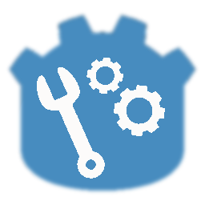

    
                                 
        
    

    <h1 align="center">Wedot Game Engine</h1>
    
Dream games, let's create them together：
        <a href="http://qm.qq.com/cgi-bin/qm/qr?_wv=1027&k=feHFQN3fYumIlOVNF_5nApTLUmuil3jw&authKey=6Z%2BXqXfjmY%2BDfy68m1XOplBkiPA%2FzQ%2Bms0bUDrV2uRcMzj6U%2B0zhVapkTFEMXkau&noverify=0&group_code=112652189">
        	Contact our QQ group!
        </a>
      
    

        <a href="README.md" style="margin-right: 10px;">简体中文</a>
        <a href="README-EH.md">English</a>
    

## We Promise that!
> No political elements, only focused on pure game development. Make the game engine just a game engine.
> 
> Pursuing the simplest happiness and natural beauty.
> 
> 2D and 3D cross-platform game engine.

## Current Plan!
 1. Integrate the new 3D physics engine [Jolt.](https://github.com/jrouwe/JoltPhysics)
    
 3. Add simple post-processing functions for rendering.
    
 5. Create a source code tutorial for more people to join.

